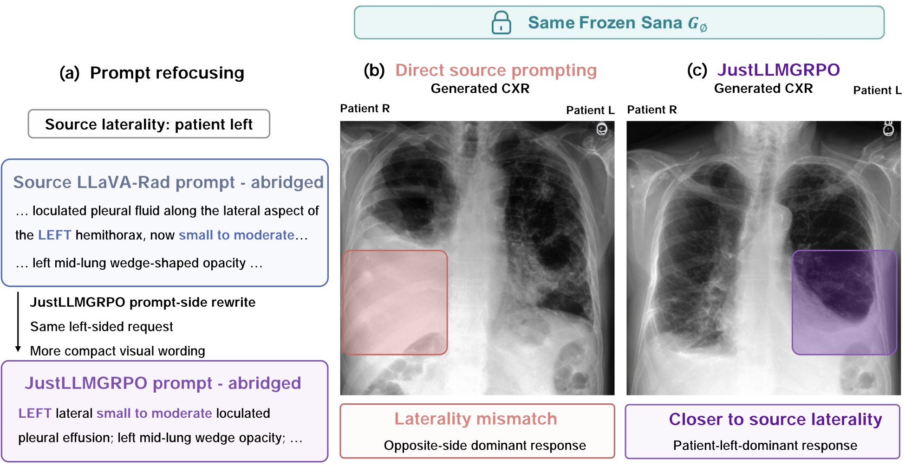
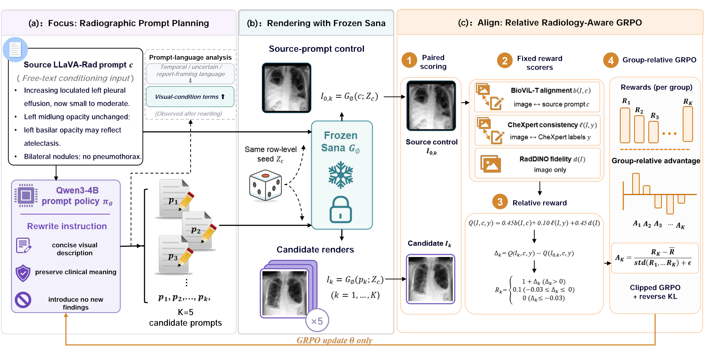
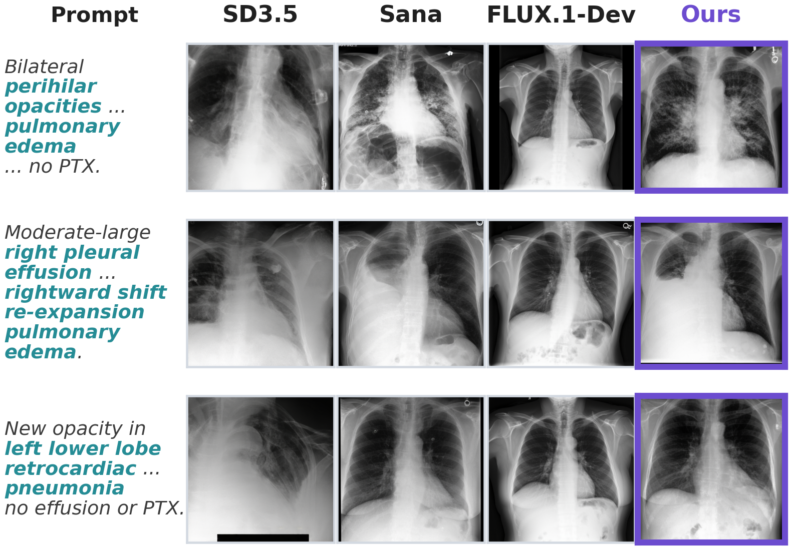

<div align="center">

# JustLLMGRPO

### Radiographic Control for Chest X-Ray Generation

**Optimize the prompt policy while keeping the image generator frozen.**

[](LICENSE)
[](environment.yml)
[](configs/paper_experiment.env)
[](https://huggingface.co/raman07/CheXGenBench-Models-Sana-e20)

[Overview](#overview) · [Quick start](#quick-start) · [Training](#training) · [Inference](#inference) · [Reproducibility](#reproducibility)

</div>

Official implementation of **JustLLMGRPO**, a prompt-policy optimization framework for text-conditioned chest X-ray (CXR) generation. JustLLMGRPO applies standard Group Relative Policy Optimization (GRPO) only to an LLM prompt planner; the CXR-adapted Sana generator and all reward models remain frozen.

<p align="center">
  
  <br>
  <sub>Prompt-policy optimization restores the requested radiographic finding under the same frozen generator.</sub>
</p>

## Overview

Existing work has largely improved CXR synthesis by optimizing image generators. JustLLMGRPO explores a complementary optimization axis: reformulating the language condition supplied to an already adapted generator.

| Frozen image generator | Trainable prompt policy | Image-based feedback |
|:---:|:---:|:---:|
| Sana is never updated | An LLM proposes visually focused prompts | Radiology-aware rewards guide GRPO |

On the paper benchmark, using the same frozen CXR-adapted Sana generator:

| Conditioning strategy | RadDINO-FID ↓ | Source-prompt alignment ↑ |
|---|---:|---:|
| Source prompt | 54.225 | 0.695 |
| **JustLLMGRPO** | **26.780** | **0.696** |

This corresponds to a **50.6% reduction in RadDINO-FID** while maintaining aggregate alignment with the source prompt.

### Release scope

This repository contains the code required for:

- **LLM-GRPO training** with frozen Sana and radiology-aware image feedback;
- **checkpoint merging** from VERL/FSDP shards to Hugging Face format;
- **LLM + Sana inference**, from source-prompt rewriting to CXR generation.

## Quick start

> [!IMPORTANT]
> Training requires controlled-access MIMIC-CXR data, the CheXGenBench/LLaVA-Rad annotations, local reward assets, and five high-memory GPUs for the reported configuration. Inference only requires a merged prompt-policy checkpoint and frozen Sana.

```bash
git clone https://github.com/pxcai/JustLLMGRPO.git
cd JustLLMGRPO

conda env create -f environment.yml
conda activate justllmgrpo
bash scripts/install_third_party.sh
pip install -e .

cp configs/paths.env.example configs/paths.env
# Edit configs/paths.env before training.
```

Train the prompt policy:

```bash
bash scripts/train_justllmgrpo.sh
```

Run end-to-end inference with a merged checkpoint:

```bash
INPUT_CSV=examples/prompts.csv \
PLANNER_MODEL=/path/to/merged_policy \
OUTPUT_DIR=outputs/example_inference \
bash scripts/infer.sh
```

## Method

For each source CXR prompt, the LLM policy samples a group of candidate prompts. Frozen Sana renders each candidate and a source-prompt control from matched initial noise. A radiology-aware reward combines BioViL-T alignment, CheXpert-label consistency, and RadDINO fidelity, then measures the candidate improvement over its matched control. GRPO uses these relative rewards to update only the LLM prompt policy.

The shared training and inference template, together with output parsing, is implemented in [`llm_sana/prompts.py`](llm_sana/prompts.py).

<p align="center">
  
  <br>
  <sub>JustLLMGRPO samples prompt candidates, renders them with frozen Sana, and updates only the LLM policy.</sub>
</p>

<details>
<summary><strong>Repository structure</strong></summary>

```text
JustLLMGRPO/
├── configs/
│   ├── paper_experiment.env      # reported hyperparameters
│   └── paths.env.example         # local data and model paths
├── inference/
│   ├── rewrite_prompts.py        # LLM prompt rewriting
│   ├── generate_sana.py          # frozen Sana rendering
│   └── run_inference.py          # end-to-end pipeline
├── llm_sana/
│   ├── data/                     # CSV-to-VERL parquet conversion
│   ├── rewards/                  # online rendering and reward computation
│   └── run_verl_qwen3_llm_sana_grpo.sh
├── scripts/                      # setup, training, merge, and inference launchers
├── third_party/verl_overrides/   # modifications to the pinned VERL revision
├── tools/build_reward_classifier.py
├── examples/                     # synthetic smoke-test inputs
├── tests/                        # lightweight unit tests
└── docs/                         # data, reproducibility, and troubleshooting notes
```

</details>

## Installation

The reported run used Linux, Python 3.10, PyTorch 2.6.0, CUDA 11.8, Transformers 4.57.0, Diffusers 0.37.0, and a pinned VERL development revision. It used five 80-GB GPUs: two for policy optimization and three for rendering and reward computation.

### Conda

```bash
conda env create -f environment.yml
conda activate justllmgrpo
bash scripts/install_third_party.sh
pip install -e .
```

### Existing Python 3.10 environment

```bash
bash scripts/setup_env.sh
```

`setup_env.sh` installs the CUDA 11.8 PyTorch wheels by default. For another CUDA build, override `TORCH_INDEX_URL`, `TORCH_SPEC`, and `TORCHVISION_SPEC` together.

Both installation routes clone VERL at revision `4cd50e69b73b4ff0df750264f89e49c94c112c15`, apply the files in `third_party/verl_overrides`, and install the patched checkout in editable mode. See [`THIRD_PARTY.md`](THIRD_PARTY.md) for details and upstream licenses.

## Data and model assets

This repository does not redistribute MIMIC-CXR, patient metadata, model weights, checkpoints, or experiment outputs. The qualitative panel below is included only as a paper illustration.

### Required data

- MIMIC-CXR-JPG images obtained under the PhysioNet data-use agreement;
- CheXGenBench/LLaVA-Rad training and validation annotation CSVs;
- a real-CXR reference subset for the RadDINO cache and frozen reward classifier.

### Required model references

| Component | Default reference |
|---|---|
| Initial prompt policy | `Qwen/Qwen3-4B-Thinking-2507` |
| Frozen CXR renderer | `raman07/CheXGenBench-Models-Sana-e20` |
| Image-text reward | `microsoft/BiomedVLP-BioViL-T` |
| Image fidelity encoder | `microsoft/rad-dino` |

Model arguments accept either Hugging Face repository IDs or local snapshot directories. For offline execution, download all model repositories first and set `LLMSANA_LOCAL_FILES_ONLY=1`.

Copy the path template and replace every placeholder:

```bash
cp configs/paths.env.example configs/paths.env
```

The input schema and controlled-data requirements are documented in [`docs/DATA.md`](docs/DATA.md).

### Build the frozen CheXpert classifier

```bash
python tools/build_reward_classifier.py \
  --csv /path/to/training_data_20K.csv \
  --image-root /path/to/mimic-cxr-jpg \
  --output artifacts/best_classifier.pt
```

The paper configuration uses a ResNet-50 trained for 20 epochs with seed 42.

### Build the RadDINO reference cache

```bash
REAL_CSV=/path/to/training_data_20K.csv \
REAL_IMAGE_DIR=/path/to/mimic-cxr-jpg \
OUTPUT=artifacts/raddino_train20k_ref.npz \
bash scripts/build_raddino_cache.sh
```

The paper configuration caches normalized RadDINO features for up to 20,000 real CXRs.

## Training

After editing `configs/paths.env`, launch the reported experiment with:

```bash
bash scripts/train_justllmgrpo.sh
```

The launcher reads reported hyperparameters from `configs/paper_experiment.env` and machine-specific paths from `configs/paths.env`.

| Setting | Value |
|---|---:|
| Initial policy | Qwen3-4B-Thinking-2507 |
| Source prompts per rollout batch | 64 |
| Candidate prompts per source prompt | 5 |
| Optimization steps | 400 |
| Learning rate | `1e-6` |
| GRPO clip ratio | `0.2` |
| KL coefficient | `1e-3` |
| Maximum input / output length | 768 / 2,048 tokens |
| BioViL-T / label / RadDINO weights | 0.45 / 0.10 / 0.45 |
| Sana generation | 512×512, 20 steps, CFG 4.5 |
| Training seed | 42 |

For a lightweight pipeline check, reduce the batch sizes and rollout count:

```bash
TRAIN_BATCH_SIZE=8 \
PPO_MINI_BATCH_SIZE=8 \
ROLLOUT_N=2 \
TOTAL_TRAINING_STEPS=5 \
BALANCED_VAL_PER_LABEL=0 \
bash scripts/train_justllmgrpo.sh
```

This debug configuration validates the pipeline but does not reproduce the paper result. Training artifacts are stored under `outputs/<run-name>/`.

### Merge a VERL checkpoint

VERL stores the FSDP actor as distributed shards. Merge a selected checkpoint into Hugging Face format before inference:

```bash
RUN_DIR=outputs/<run-name> \
STEP=400 \
bash scripts/merge_checkpoint.sh
```

The merged policy is written to `outputs/<run-name>/merged_hf/global_step_400/`. If `STEP` is omitted, the script uses the latest saved checkpoint.

## Inference

The end-to-end pipeline rewrites each unique source prompt once and then renders the optimized prompt with frozen Sana.

```bash
INPUT_CSV=examples/prompts.csv \
PLANNER_MODEL=outputs/<run-name>/merged_hf/global_step_400 \
OUTPUT_DIR=outputs/example_inference \
bash scripts/infer.sh
```

For a two-GPU vLLM planner:

```bash
INPUT_CSV=/path/to/prompts.csv \
PLANNER_MODEL=/path/to/merged_policy \
PLANNER_BACKEND=vllm \
PLANNER_TP_SIZE=2 \
OUTPUT_DIR=outputs/inference \
bash scripts/infer.sh
```

The output directory contains:

```text
outputs/inference/
├── optimized_prompts.csv
├── metadata.csv
└── images/
```

`metadata.csv` records the source prompt, optimized prompt, deterministic generation seed, and generated-image path. LLM inference uses greedy decoding by default and shares the prompt template and parser used during training.

The two stages are also available separately:

```bash
python -m inference.rewrite_prompts --help
python -m inference.generate_sana --help
```

## Qualitative examples

The final column below uses prompts produced by JustLLMGRPO and images rendered by the same frozen Sana generator. The examples illustrate control over pulmonary edema, pleural effusion, and focal opacity.

<p align="center">
  
  <br>
  <sub>Representative source-prompt-matched comparisons from the paper.</sub>
</p>

## Validation

The following checks require neither model weights nor medical images:

```bash
pytest

python -m llm_sana.data.prepare_llavarad_prompt_parquet \
  --train_csv examples/train_example.csv \
  --val_csv examples/val_example.csv \
  --output_dir /tmp/justllmgrpo_example \
  --balanced_val_per_label 0
```

Before a full training run, validate the heavyweight dependencies and configured paths:

```bash
set -a
source configs/paths.env
set +a

python llm_sana/check_llm_sana_grpo_env.py \
  --model "$MODEL_PATH" \
  --sana-model "$SANA_MODEL_PATH" \
  --biovil-path "$BIOVIL_T_PATH" \
  --classifier-checkpoint "$CXR_CLASSIFIER_CHECKPOINT" \
  --raddino-path "$RAD_DINO_PATH" \
  --raddino-cache "$RADDINO_REFERENCE_CACHE"
```

## Reproducibility

- The released defaults match the reported 400-step run with seed 42.
- Sana, BioViL-T, the CheXpert classifier, and RadDINO remain frozen.
- Candidate and source-control images use matched deterministic seeds during training.
- Invalid policy outputs receive zero reward; inference falls back to the source prompt.
- MIMIC-CXR is controlled-access clinical data. Never commit patient-derived data, images, identifiers, or credentials.
- Generated CXRs are research outputs and must not be used for clinical diagnosis.

See [`docs/REPRODUCIBILITY.md`](docs/REPRODUCIBILITY.md) for the full protocol and [`docs/TROUBLESHOOTING.md`](docs/TROUBLESHOOTING.md) for common setup and runtime issues.

## Citation

```bibtex
@article{cai2026justllmgrpo,
  title   = {JustLLMGRPO: Radiographic Control for Chest X-Ray Generation},
  author  = {Cai, Pengxiang and Li, Xiaohan and Liu, Anglin and Zeng, Qingyuan and Li, Zexun and Chen, Jintai},
  year    = {2026}
}
```

## License

Original code in this repository is released under the [Apache License 2.0](LICENSE). Patched VERL files and downloaded models remain subject to their upstream licenses; see [`THIRD_PARTY.md`](THIRD_PARTY.md).
